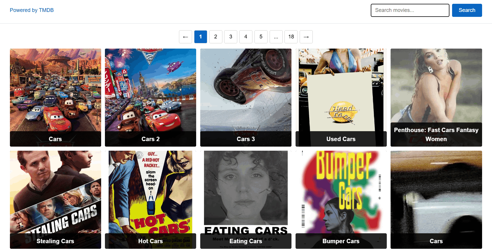
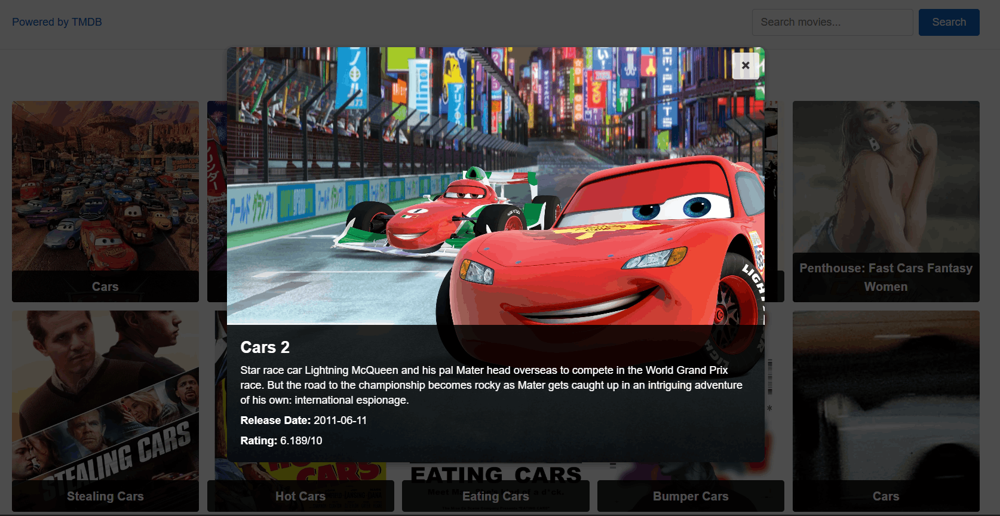

## Movie Search

A responsive movie search application built with React and TypeScript. Users can search for movies, browse paginated results, and view detailed movie information using data from the TMDB API.

### Live Demo

[View Live Demo](https://04-react-query-mu-ashy.vercel.app/)

### Screenshots





### About the Project & Features

Movie Search is a responsive web application for searching and exploring movies.

#### Features

- Search movies by title
- Paginated search results
- Movie details displayed in a modal window
- Movie poster and backdrop images
- Release date and rating information
- Loading and error states
- Notification when no movies are found
- Lazy loading for movie poster images
- Keyboard support for closing the modal with Escape
- Graceful handling of movies without poster images

The application uses React Query to manage server state, cache requests, and preserve previously loaded results while navigating between pages.

### Technologies

- React
- TypeScript
- React Query
- Axios
- React Paginate
- React Hot Toast
- CSS Modules
- Vite
- TMDB API

### Project Structure

```text
src/
├── components/
│ ├── App/
│ ├── ErrorMessage/
│ ├── Loader/
│ ├── MovieGrid/
│ ├── MovieModal/
│ └── SearchBar/
├── services/
│ └── movieService.ts
├── types/
│ └── movie.ts
├── global.css
└── main.tsx
```

The project follows a component-based architecture with separate modules for UI components, API communication, and TypeScript types.

### Getting Started

#### 1. Clone the repository

   git clone https://github.com/Serhii-Taran-dev/movie-search.git
   
   cd movie-search

#### 2. Install dependencies

   npm install

#### 3. Configure environment variables

Create a .env file in the project root and add your TMDB API token:

VITE_TMDB_TOKEN=your_tmdb_token

#### 4. Start the development server

npm run dev

The application will be available at the local address provided by Vite.

### Environment Variables

The application requires the following environment variable:

| Variable | Description |
| --- | --- |
| `VITE_TMDB_TOKEN` | TMDB API Bearer token |

### Author

#### Serhii Taran

- GitHub: Serhii-Taran-dev
